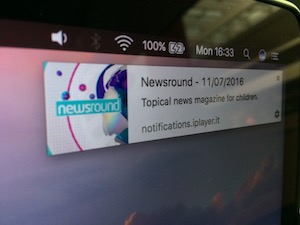

# Pushover

A quick hack/proof of concept to show Web Push Notifications with a URL payload,
for iPlayer programmes, based on user & availability.
Only very quickly tested in Chrome/Firefox. YMMV!

## Setup
* Update the config object in push-server/server.js
* Add in a sender id in push-client/manifest.json
* Create a webserver to expose the contents of push-client
* Create a proxy for /api to hit your node application

Clicking on headings shows your noficiations/iBLs' A-Z list.

## TOOD
* A clean way to do the SNS notifications/subscription
* The UI looks like a 5 year old finger painted it.
